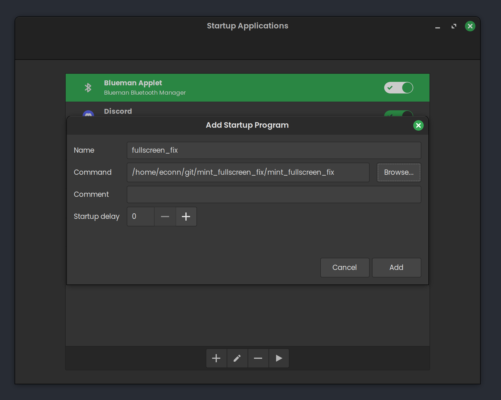

# Linux Mint Fullscreen bug fix

This is a workaround to a linux mint(muffin) bug here [#656](https://github.com/linuxmint/muffin/issues/656)

## Setup Guide

Clone the repo

`git clone https://github.com/IrishBruse/mint_fullscreen_fix.git`

Move to the folder

`cd mint_fullscreen_fix`

then build the application

`make`

to test it out you can run

`./mint_fullscreen_fix`

If it works to fix it you can the set it to run on startup using the starup application app like below

